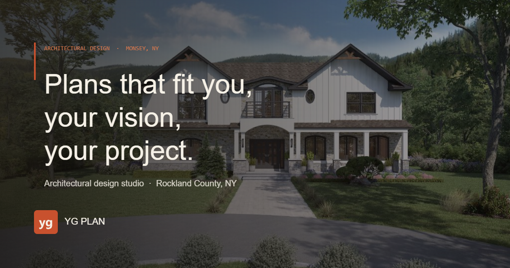
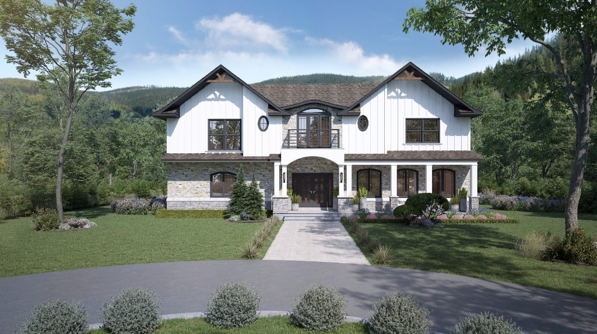

# YG Plans

Responsive portfolio website for an architecture and planning studio in Monsey, New York.

[View the live site](https://yg-plans-repo.vercel.app/)



## Project goals

YG Plan needed a clear, credible web presence that could make a visual body of work easy to explore on desktop and mobile. The site balances an editorial portfolio with practical service information and direct paths for prospective clients to get in touch.

## What the site presents

- Custom homes and additions
- Semi-attached and multifamily projects
- Shuls and community buildings
- Renovations and site planning
- A filterable project gallery with image lightboxes
- A responsive contact experience

## Technical approach

The site is intentionally lightweight: semantic HTML, a shared CSS system, and focused JavaScript for navigation, filtering, motion, the lightbox, and the contact flow. It is deployed as a static Vercel project, with no framework runtime or database required.

Key implementation choices include responsive layouts, reduced-motion support, lazy-loaded project media, structured metadata, a sitemap, and reusable service-page patterns.

## Selected work



The portfolio includes residential, multifamily, renovation, community, and site-planning work. Project imagery is organized under `assets/work/` and presented through the homepage and the dedicated work gallery.

## My role

I handled the website strategy, visual design, frontend implementation, responsive behavior, deployment setup, and final quality pass.

## Local preview

No build step is required.

```bash
python -m http.server 8000
```

Open `http://localhost:8000` and use the same relative URLs served in production.

## Deployment

The production site is deployed on Vercel at [yg-plans-repo.vercel.app](https://yg-plans-repo.vercel.app/). `vercel.json`, `robots.txt`, and `sitemap.xml` contain the deployment and indexing configuration.

## Repository note

This is a portfolio case study and production website source. No open-source license is granted by this repository.
